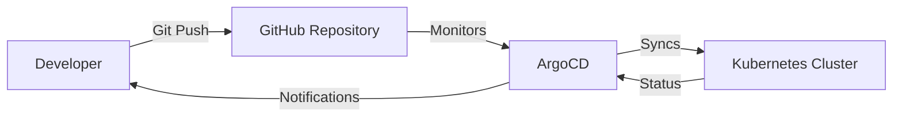

# GitOps Manifests - HRMS Platform

This repository contains Kubernetes manifests for the HRMS (Human Resource Management System) platform, managed using **GitOps** principles with **ArgoCD**.

## 📋 Table of Contents

- [Overview](#overview)
- [Repository Structure](#repository-structure)
- [How It Works](#how-it-works)
- [ArgoCD App-of-Apps Pattern](#argocd-app-of-apps-pattern)
- [Environment Management](#environment-management)
- [Key Components](#key-components)
- [Deployment Workflow](#deployment-workflow)
- [Getting Started](#getting-started)

## 🎯 Overview

This repository implements a **GitOps workflow** where:
- Git is the single source of truth for Kubernetes manifests
- ArgoCD continuously monitors this repository and automatically syncs changes to the cluster
- All infrastructure and application deployments are declarative and version-controlled
- Changes are deployed by committing to this repository (no manual `kubectl apply`)

## 📁 Repository Structure

```
gitops-manifests/
├── argo/                           # ArgoCD Application definitions (App-of-Apps pattern)
│   ├── Chart.yaml                  # Helm chart metadata
│   ├── values.yaml                 # Default values for ArgoCD apps
│   └── templates/                  # ArgoCD Application manifests
│       ├── hrms-root-app.yaml      # Root application (deploys all other apps)
│       ├── hrms-project.yaml       # ArgoCD project definition
│       ├── hrms-staging-project.yaml
│       ├── hrms-prod-project.yaml
│       ├── app-*.yaml              # Individual application definitions
│       └── ...
│
├── base/                           # Base Kubernetes manifests (DRY principle)
│   ├── namespace.yaml              # Namespace definitions
│   ├── ingress.yaml                # Base ingress configuration
│   ├── services/                   # Microservices manifests
│   │   ├── attendance-service/
│   │   ├── audit-service/
│   │   ├── compliance-service/
│   │   ├── employee-service/
│   │   ├── leave-service/
│   │   ├── notification-service/
│   │   └── user-service/
│   ├── frontend/                   # Frontend application
│   ├── mysql/                      # MySQL database
│   ├── kafka/                      # Kafka messaging
│   ├── redis/                      # Redis cache
│   ├── istio/                      # Istio service mesh
│   ├── external-secrets/           # External Secrets Operator
│   └── ...
│
├── overlays/                       # Environment-specific customizations (Kustomize)
│   ├── staging/                    # Staging environment overrides
│   │   ├── istio/
│   │   └── ...
│   ├── production/                 # Production environment overrides
│   │   ├── istio/
│   │   └── ...
│   └── README.md
│
├── scripts/                        # Utility scripts
└── .github/                        # GitHub Actions workflows
    └── workflows/
```

## 🔄 How It Works

### 1. **GitOps Workflow**



1. Developers commit Kubernetes manifest changes to this repository
2. ArgoCD detects changes automatically 
3. ArgoCD syncs the desired state to the Kubernetes cluster
4. Applications are deployed/updated automatically

### 2. **App-of-Apps Pattern**

This repository uses the **App-of-Apps pattern**:
- **Root App** (`hrms-root-app.yaml`) is deployed first
- The root app points to the `argo/` directory (Helm chart)
- ArgoCD renders the Helm chart and creates all child applications
- Each child application manages a specific component (microservice, database, etc.)

## 🏗️ ArgoCD App-of-Apps Pattern

### Root Application

The entry point is [`argo/templates/hrms-root-app.yaml`](argo/templates/hrms-root-app.yaml):

```yaml
apiVersion: argoproj.io/v1alpha1
kind: Application
metadata:
  name: hrms
  namespace: argocd
spec:
  project: hrms
  source:
    repoURL: 'https://github.com/PookieLand/gitops-manifests.git'
    targetRevision: main
    path: argo  # Points to the Helm chart
  destination:
    server: 'https://kubernetes.default.svc'
    namespace: argocd
  syncPolicy:
    automated:
      prune: true      # Delete resources when removed from Git
      selfHeal: true   # Auto-sync when cluster state drifts
```

### Child Applications

The `argo/templates/` directory contains **51 ArgoCD Applications**, each managing a specific component:

#### Infrastructure Components
- **Istio Service Mesh**: `app-istio-base.yaml`, `app-istiod.yaml`, `app-istio-gateway.yaml`
- **External Secrets**: `app-external-secrets.yaml` (manages secrets from AWS Secrets Manager)
- **Kafka**: `app-strimzi-operator.yaml`, `app-kafka-*.yaml`, `app-kafka-topics-*.yaml`
- **Databases**: `app-mysql-*.yaml`, `app-redis-*.yaml`
- **Monitoring**: `app-fluentbit-*.yaml`, `app-metrics-server.yaml`
- **Cert Manager**: `app-certmanager.yaml`

#### HRMS Microservices (Staging & Production)
- `app-attendance-staging.yaml` / `app-attendance-production.yaml`
- `app-audit-staging.yaml` / `app-audit-production.yaml`
- `app-compliance-staging.yaml` / `app-compliance-production.yaml`
- `app-employee-staging.yaml` / `app-employee-production.yaml`
- `app-leave-staging.yaml` / `app-leave-production.yaml`
- `app-notification-staging.yaml` / `app-notification-production.yaml`
- `app-user-staging.yaml` / `app-user-production.yaml`
- `app-frontend-staging.yaml` / `app-frontend-production.yaml`

## 🌍 Environment Management

### Staging vs Production

The repository supports **two environments**:

1. **Staging**: For testing and validation
   - Namespace: `staging`
   - Applications: `app-*-staging.yaml`
   - Overlays: `overlays/staging/`

2. **Production**: For live workloads
   - Namespace: `production`
   - Applications: `app-*-production.yaml`
   - Overlays: `overlays/production/`

### Kustomize Overlays

Environment-specific customizations use **Kustomize**:

```bash
# Deploy staging Istio networking
kustomize build overlays/staging/istio/networking | kubectl apply -f -

# Deploy production Istio networking
kustomize build overlays/production/istio/networking | kubectl apply -f -
```

The `base/` directory contains DRY (Don't Repeat Yourself) manifests, and `overlays/` apply environment-specific patches.

## 🔑 Key Components

### 1. **ArgoCD Projects**

Three projects organize applications:
- **hrms**: Main project for staging applications
- **hrms-staging**: Staging-specific project
- **hrms-prod**: Production-specific project

### 2. **External Secrets**

Secrets are managed externally (AWS Secrets Manager) using the **External Secrets Operator**:
- `app-external-secrets.yaml`: Deploys the operator
- `app-external-secrets-resources.yaml`: Defines SecretStores and ExternalSecrets

### 3. **Service Mesh (Istio)**

Istio provides:
- Traffic management
- Security (mTLS)
- Observability
- Gateway ingress

### 4. **Kafka Messaging**

Strimzi Operator manages Kafka:
- Multiple Kafka clusters (staging/production)
- Topic management via Kubernetes CRDs

## 🚀 Deployment Workflow

### Initial Setup

1. **Install ArgoCD** on your Kubernetes cluster (via Terraform/Ansible)
2. **Deploy the root application**:
   ```bash
   kubectl apply -f argo/templates/hrms-root-app.yaml
   ```
3. ArgoCD automatically creates all child applications from the `argo/` Helm chart

### Making Changes

1. **Edit manifests** in this repository (e.g., update a deployment image)
2. **Commit and push** to the `main` branch
3. **ArgoCD detects changes** and syncs automatically (within 3 minutes)
4. **Verify deployment** in ArgoCD UI or via CLI

### Rollback

Since Git is the source of truth:
1. **Revert the commit** in Git
2. **Push the revert**
3. ArgoCD automatically rolls back the cluster state

## 🏁 Getting Started

### Prerequisites

- Kubernetes cluster (EKS, GKE, etc.)
- ArgoCD installed
- Access to this GitHub repository

### Deploy Everything

```bash
# Apply the root application
kubectl apply -f argo/templates/hrms-root-app.yaml

# Watch ArgoCD sync all applications
kubectl get applications -n argocd -w
```

### Access ArgoCD UI

```bash
# Port-forward to ArgoCD server
kubectl port-forward svc/argocd-server -n argocd 8080:443

# Open browser
open https://localhost:8080
```

### Verify Deployments

```bash
# Check all applications
kubectl get applications -n argocd

# Check staging microservices
kubectl get pods -n staging

# Check production microservices
kubectl get pods -n production
```

## 📚 Additional Resources

- [ArgoCD Documentation](https://argo-cd.readthedocs.io/)
- [Kustomize Documentation](https://kustomize.io/)
- [Istio Documentation](https://istio.io/latest/docs/)
- [External Secrets Operator](https://external-secrets.io/)

---

**Repository**: [PookieLand/gitops-manifests](https://github.com/PookieLand/gitops-manifests)  
**Maintained by**: PookieLand Team
